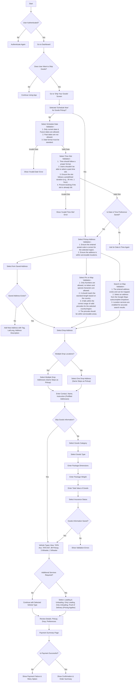

```mermaid
flowchart TD
    Z["Start"] --> A{"User Authenticated?"}
    A -- No --> B["Authenticate Again"]
    A -- Yes --> C["Go to Dashboard"]
    C --> D{"Does User Want to Ship Goods?"}
    D -- No --> E["Continue Using App"]
    D -- Yes --> F["Go to 'Ship Your Goods' Screen"]
    F --> G["Selected 'Schedule Now' for Goods Pickup?"]
    G -- Yes --> H["Select Pickup Address
    Validation - 
    1. Ensure the entered postal code is correct for the selected region.
    2. Ensure the address is within serviceable locations."]
    G -- No --> I1["Select Schedule Date
    Validation - 
    1. Only current date & Future dates are allowed.
    2. Past dates are not allowed.
    3. Date format must be standard."]
    I1 -- Invalid Date --> I2["Show 'Invalid Date' Error"]
    I1 -- Valid Date --> K1["Select Time Slot
    Validation -
    1.  Time should follow a proper format.
    2. Users shouldn't be able to select a past time slot.
    3. Ensure the slot follows a predefined duration (e.g., 30 min, 1 hour).
    4. Prevent booking if the slot is already full."]
    K1 -- Invalid Slot --> K2["Show 'Invalid Time Slot' Error"]
    K1 -- Valid Slot --> M{"Is Date & Time Preference Saved?"}
    M -- Yes --> H
    M -- No --> N["Ask for Date & Time Again"]
    H --> O["Search on Map
    Validation -
    1. The entered address exists and can be mapped.
    2. Select an address from the Google Maps autocomplete dropdown.
    3. Location services are enabled for accurate search results."] 
    H --> P["Select Pin on Map
    Validation -
    1. Only Numbers are allowed, no letters and special characters are allowed.
    2. It should match the standard length based on the country.
    3. It falls within the correct range of valid pincodes for the selected country/region.
    4. The pincode should be within serviceable areas."]
    H --> Q["Select from Saved Address"]
    Q --> S{"Saved Address Exists?"}
    S -- No --> T["Add New Address with Tag, Lat/Long, Address Description"]
    S -- Yes --> U[""Select Drop Address]
    P --> U
    O --> U
    U --> V{"Multiple Drop Locations?"}
    V -- Yes --> W["Select Multiple Drop Addresses (Same Steps as Pickup)"]
    V -- No --> X["Select One Drop Address (Same Steps as Pickup)"]
    W --> Y["Enter Contact, Name, Instruction (Prefilled Addresses)"]
    X --> Y

    Y --> AB{"Skip Goods Information?"}
    AB -- Yes --> AC["Vehicle Types View: TATA Ace, TATA 407, 8ft Pickup, 3 Wheeler, 2 Wheeler"]
    AB -- No --> AD1["Select Goods Category"] --> AD2["Select Goods Type"] --> AD3["Enter Package Dimensions"] --> AD4["Enter Package Weight"] --> AD5["Enter Total Value of Goods"] --> AD6["Select Insurance Status"]
    AD6 --> AE{"Goods Information Saved?"}
    AE -- No --> AF["Show Validation Errors"]
    AE -- Yes --> AC
    AC --> AG{"Additional Services Required?"}
    AG -- Yes --> AH["Select: Loading & Unloading, Only Loading, Only Unloading, Proof of Delivery (Pricing Applies)"]
    AG -- No --> AI["Continue with Selected Vehicle Type"]
    AI --> AJ["Review Details: Pickup, Drop, Preferences"]
    AH --> AJ
    AJ --> AK["Payment Summary Page"]
    AK --> AL{"Is Payment Successful?"}
    AL -- No --> AM["Show Payment Failure & Retry Option"]
    AL -- Yes --> AN["Show Confirmation & Order Summary"]
```

