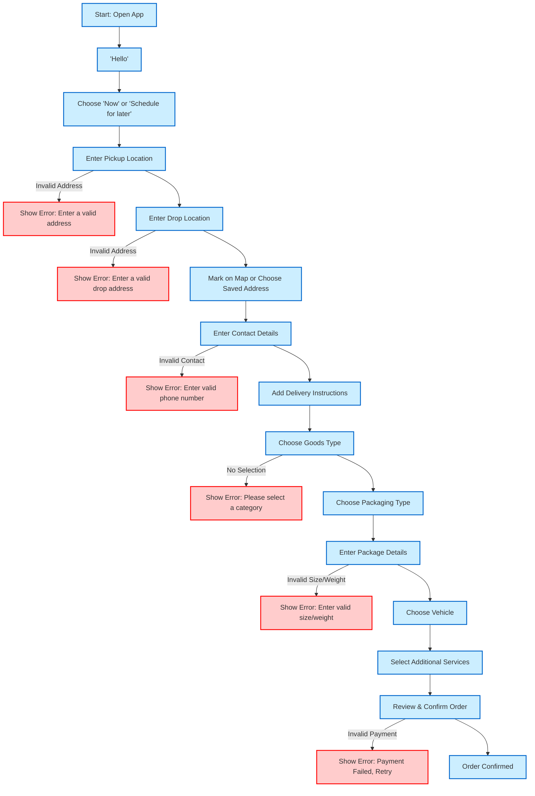

```mermaid 
   graph TD;
    A[Start: Open App] --> B['Hello']
    B --> C[Choose 'Now' or 'Schedule for later']
    C --> D[Enter Pickup Location]
    D -->|Invalid Address| D1[Show Error: Enter a valid address]
    D --> E[Enter Drop Location]
    E -->|Invalid Address| E1[Show Error: Enter a valid drop address]
    
    E --> F[Mark on Map or Choose Saved Address]
    F --> G[Enter Contact Details]
    G -->|Invalid Contact| G1[Show Error: Enter valid phone number]
    G --> H[Add Delivery Instructions]
    
    H --> I[Choose Goods Type]
    I -->|No Selection| I1[Show Error: Please select a category]
    
    I --> J[Choose Packaging Type]
    J --> K[Enter Package Details]
    K -->|Invalid Size/Weight| K1[Show Error: Enter valid size/weight]
    
    K --> L[Choose Vehicle]
    L --> M[Select Additional Services]
    M --> N[Review & Confirm Order]
    
    N -->|Invalid Payment| N1[Show Error: Payment Failed, Retry]
    N --> O[Order Confirmed]

    %% Styling %%
    classDef error fill:#ffcccc,stroke:#ff0000,stroke-width:2px;
    classDef process fill:#cceeff,stroke:#0066cc,stroke-width:2px;
    
    class A,B,C,D,E,F,G,H,I,J,K,L,M,N,O process;
    class D1,E1,G1,I1,K1,N1 error;
```
