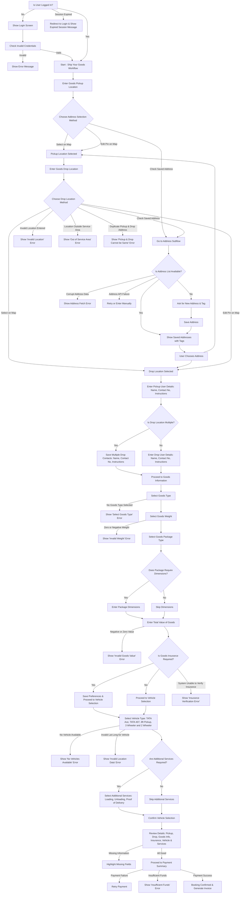

```mermaid
graph TD;

    %% Login Edge Cases
    A[Is User Logged In?] -->|No| B[Show Login Screen]
    B --> B1[Check Invalid Credentials]
    B1 -->|Invalid| B2[Show Error Message]
    B1 -->|Valid| C[Start Workflow]
    
    A -->|Yes| C[Start : Ship Your Goods Workflow]
    A -->|Session Expired| A1[Redirect to Login & Show Expired Session Message]

    %% Pickup Location Flow
    C --> D[Enter Goods Pickup Location]
    D --> E{Choose Address Selection Method}
    
    E -- Select on Map --> F[Pickup Location Selected]
    E -- Edit Pin on Map --> F
    E -- Check Saved Address --> G[Go to Address Subflow]

    %% Address Selection Edge Cases
    G --> H{Is Address List Available?}
    H -- Yes --> I[Show Saved Addresses with Tags]
    H -- No --> J[Ask for New Address & Tag] --> K[Save Address] --> I
    H -- Corrupt Address Data --> H1[Show Address Fetch Error]
    H -- Address API Failure --> H2[Retry or Enter Manually]

    I --> L[User Chooses Address] --> F

    F --> M[Enter Goods Drop Location]
    M --> N{Choose Drop Location Method}
    
    N -- Select on Map --> O[Drop Location Selected]
    L --> O
    N -- Edit Pin on Map --> O
    N -- Check Saved Address --> G

    %% Drop Location Edge Cases
    N -- Invalid Location Entered --> N1[Show 'Invalid Location' Error]
    N -- Location Outside Service Area --> N2[Show 'Out of Service Area' Error]
    N -- Duplicate Pickup & Drop Address --> N3[Show 'Pickup & Drop Cannot be Same' Error]

    %% User Details Input
    O --> P[Enter Pickup User Details: Name, Contact No, Instructions]
    
    P --> Q{Is Drop Location Multiple?}
    Q -- Yes --> R[Save Multiple Drop Contacts: Name, Contact No, Instructions]
    Q -- No --> S[Enter Drop User Details: Name, Contact No, Instructions]
    
    R --> T[Proceed to Goods Information]
    S --> T

    %% Goods Info Edge Cases
    T --> U[Select Goods Type]
    U -- No Goods Type Selected --> U1[Show 'Select Goods Type' Error]

    U --> V[Select Goods Weight]
    V -- Zero or Negative Weight --> V1[Show 'Invalid Weight' Error]
    
    V --> W[Select Goods Package Type]
    W --> X{Does Package Require Dimensions?}
    
    X -- Yes --> Y[Enter Package Dimensions]
    X -- No --> Z[Skip Dimensions]

    Y --> AA[Enter Total Value of Goods]
    AA -- Negative or Zero Value --> AA1[Show 'Invalid Goods Value' Error]
    
    Z --> AA

    %% Insurance Edge Cases
    AA --> BB{Is Goods Insurance Required?}
    BB -- Yes --> CC[Save Preferences & Proceed to Vehicle Selection]
    BB -- No --> DD[Proceed to Vehicle Selection]
    BB -- System Unable to Verify Insurance --> BB1[Show 'Insurance Verification Error']

    %% Vehicle Selection Edge Cases
    CC --> EE[Select Vehicle Type: TATA Ace, TATA 407, 8ft Pickup, 3 Wheeler and 2 Wheeler]
    DD --> EE
    
    EE -- No Vehicle Available --> EE1[Show 'No Vehicles Available' Error]
    EE -- Invalid Lat-Long for Vehicle --> EE2[Show 'Invalid Location Data' Error]

    EE --> FF{Are Additional Services Required?}
    FF -- Yes --> GG[Select Additional Services: Loading, Unloading, Proof of Delivery]
    FF -- No --> HH[Skip Additional Services]

    GG --> II[Confirm Vehicle Selection]
    HH --> II

    %% Final Review & Payment
    II --> JJ[Review Details: Pickup, Drop, Goods Info, Insurance, Vehicle & Services]
    
    JJ -- Missing Information --> JJ1[Highlight Missing Fields]
    JJ -- All Good --> KK[Proceed to Payment Summary]

    %% Payment Edge Cases
    KK -- Payment Failure --> KK1[Retry Payment]
    KK -- Insufficient Funds --> KK2[Show 'Insufficient Funds' Error]
    KK -- Payment Success --> LL[Booking Confirmed & Generate Invoice]

```
