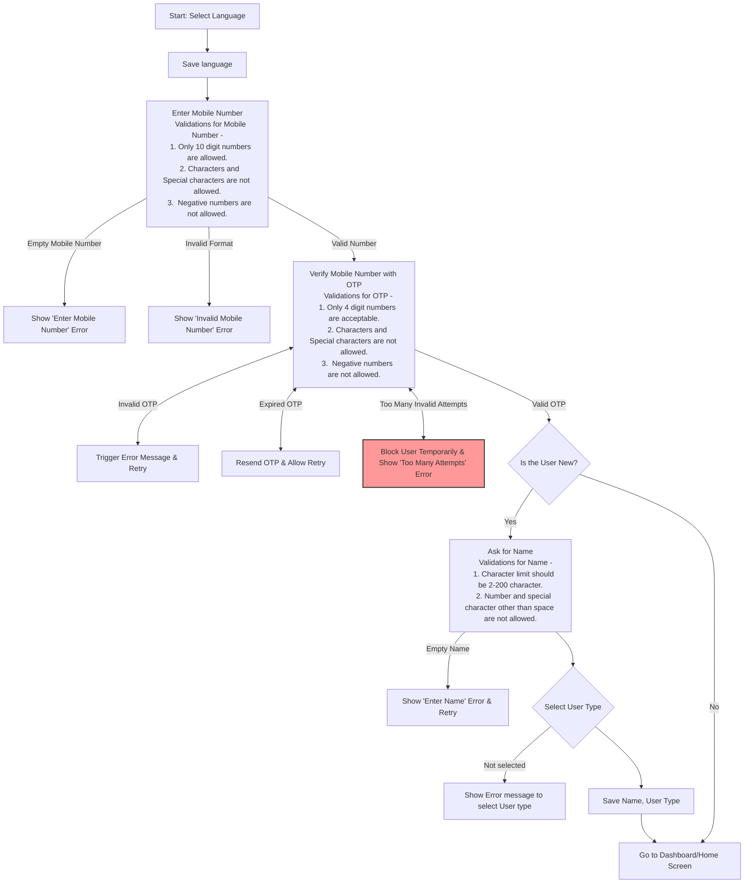

```mermaid
flowchart TD
    A["Start: Select Language"] --> B["Save language"]
    B --> C["Enter Mobile Number
    Validations for Mobile Number -
    1. Only 10 digit numbers are allowed.
   2. Characters and Special characters are not allowed.
   3.  Negative numbers are not allowed."]
    C -- Empty Mobile Number --> C1@{ label: "Show 'Enter Mobile Number' Error" }
    C -- Invalid Format --> C2@{ label: "Show 'Invalid Mobile Number' Error" }
    C -- Valid Number --> D["Verify Mobile Number with OTP
    Validations for OTP -
    1. Only 4 digit numbers are acceptable.
    2. Characters and Special characters are not allowed.
    3.  Negative numbers are not allowed."]
    D -- Invalid OTP <--> E["Trigger Error Message & Retry"]
    D -- Expired OTP <--> F["Resend OTP & Allow Retry"]
    D -- Too Many Invalid Attempts <--> D1@{ label: "Block User Temporarily & Show 'Too Many Attempts' Error" }
    D -- Valid OTP --> G{"Is the User New?"}
    G -- Yes --> H["Ask for Name
     Validations for Name -
    1. Character limit should be 2-200 character.
    2. Number and special character other than space are not allowed. "]
    H -- Empty Name --> H1@{ label: "Show 'Enter Name' Error & Retry" }
    H --> I{"Select User Type"}
    I -- Not selected --> I1["Show Error message to select User type"]
    I --> J["Save Name, User Type"]
    J --> K["Go to Dashboard/Home Screen"]
    G -- No --> K

    


    style D1 fill:#f99,stroke:#333,stroke-width:2px

  
```
