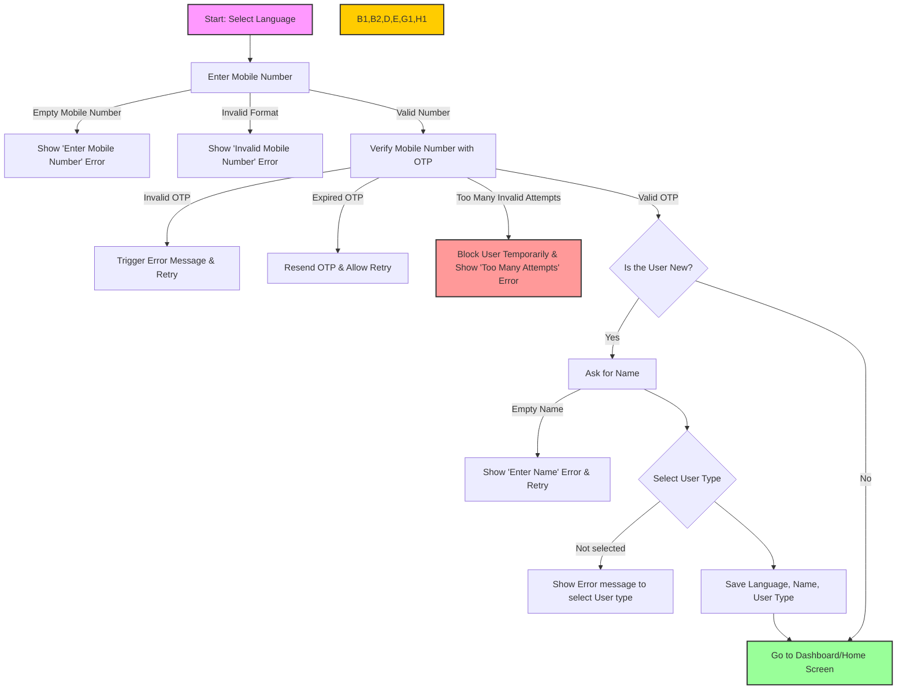

```mermaid
flowchart TD
    A["Start: Select Language"] --> B["Enter Mobile Number"]
    B -- Empty Mobile Number --> B1@{ label: "Show 'Enter Mobile Number' Error" }
    B -- Invalid Format --> B2@{ label: "Show 'Invalid Mobile Number' Error" }
    B -- Valid Number --> C["Verify Mobile Number with OTP"]
    C -- Invalid OTP --> D["Trigger Error Message & Retry"]
    C -- Expired OTP --> E["Resend OTP & Allow Retry"]
    C -- Too Many Invalid Attempts --> D1@{ label: "Block User Temporarily & Show 'Too Many Attempts' Error" }
    C -- Valid OTP --> F{"Is the User New?"}
    F -- Yes --> G["Ask for Name"]
    G -- Empty Name --> G1@{ label: "Show 'Enter Name' Error & Retry" }
    G --> H{"Select User Type"}
    H -- Not selected --> H1["Show Error message to select User type"]
    H --> I["Save Language, Name, User Type"]
    I --> J["Go to Dashboard/Home Screen"]
    F -- No --> J
   
    B1@{ shape: rect}
    B2@{ shape: rect}
    D1@{ shape: rect}
    G1@{ shape: rect}
    style A fill:#f9f,stroke:#333,stroke-width:2px
    style D1 fill:#f99,stroke:#333,stroke-width:2px
    style J fill:#9f9,stroke:#333,stroke-width:2px
    style B1,B2,D,E,G1,H1 fill:#ffcc00,stroke:#333,stroke-width:2px


```
