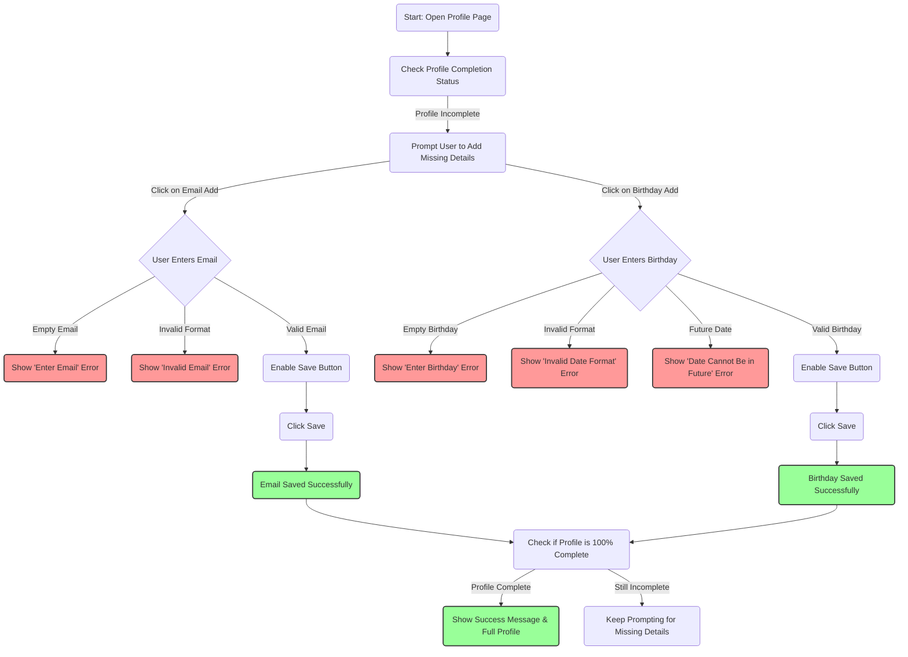

```mermaid
graph TD;
    A("Start: Open Profile Page") --> B("Check Profile Completion Status")
    
    B -- "Profile Incomplete" --> C("Prompt User to Add Missing Details")
    
    C -- "Click on Email Add" --> D{"User Enters Email"}
    D -- "Empty Email" --> D1("Show 'Enter Email' Error")
    D -- "Invalid Format" --> D2("Show 'Invalid Email' Error")
    D -- "Valid Email" --> E("Enable Save Button")
    E --> F("Click Save")
    F --> G("Email Saved Successfully")
    
    C -- "Click on Birthday Add" --> H{"User Enters Birthday"}
    H -- "Empty Birthday" --> H1("Show 'Enter Birthday' Error")
    H -- "Invalid Format" --> H2("Show 'Invalid Date Format' Error")
    H -- "Future Date" --> H3("Show 'Date Cannot Be in Future' Error")
    H -- "Valid Birthday" --> I("Enable Save Button")
    I --> J("Click Save")
    J --> K("Birthday Saved Successfully")

    G --> L("Check if Profile is 100% Complete")
    K --> L
    L -- "Profile Complete" --> M("Show Success Message & Full Profile")
    L -- "Still Incomplete" --> N("Keep Prompting for Missing Details")
    
    %% Styling
    style D1 fill:#f99,stroke:#333,stroke-width:2px
    style D2 fill:#f99,stroke:#333,stroke-width:2px
    style H1 fill:#f99,stroke:#333,stroke-width:2px
    style H2 fill:#f99,stroke:#333,stroke-width:2px
    style H3 fill:#f99,stroke:#333,stroke-width:2px
    style G fill:#9f9,stroke:#333,stroke-width:2px
    style K fill:#9f9,stroke:#333,stroke-width:2px
    style M fill:#9f9,stroke:#333,stroke-width:2px

```

