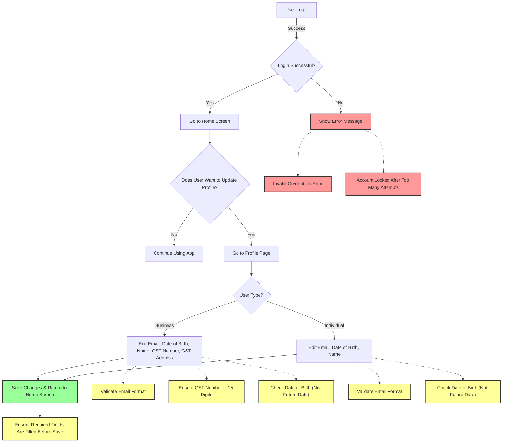

```mermaid

flowchart TD
    A["User Login"] -- Success --> B{"Login Successful?"}
    B -- No --> C["Show Error Message"]
    B -- Yes --> D["Go to Home Screen"]
    D --> E{"Does User Want to Update Profile?"}
    E -- No --> F["Continue Using App"]
    E -- Yes --> G["Go to Profile Page"]
    G --> H{"User Type?"}
    H -- Business --> I["Edit Email, Date of Birth, Name, GST Number, GST Address"]
    H -- Individual --> J["Edit Email, Date of Birth, Name"]
    I --> K["Save Changes & Return to Home Screen"]
    J --> K
    C -.-> C1["Invalid Credentials Error"] & C2["Account Locked After Too Many Attempts"]
    I -.-> I1["Validate Email Format"] & I2["Ensure GST Number is 15 Digits"] & I3["Check Date of Birth (Not Future Date)"]
    J -.-> J1["Validate Email Format"] & J2["Check Date of Birth (Not Future Date)"]
    K -.-> K1["Ensure Required Fields Are Filled Before Save"]
    style C fill:#f99,stroke:#333,stroke-width:2px
    style K fill:#9f9,stroke:#333,stroke-width:2px
    style C1 fill:#f99,stroke:#333,stroke-width:2px
    style C2 fill:#f99,stroke:#333,stroke-width:2px
    style I1 fill:#ff9,stroke:#333,stroke-width:2px
    style I2 fill:#ff9,stroke:#333,stroke-width:2px
    style I3 fill:#ff9,stroke:#333,stroke-width:2px
    style J1 fill:#ff9,stroke:#333,stroke-width:2px
    style J2 fill:#ff9,stroke:#333,stroke-width:2px
    style K1 fill:#ff9,stroke:#333,stroke-width:2px

```
