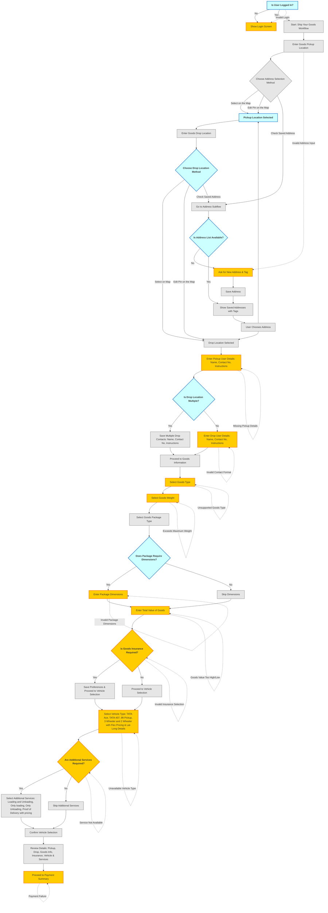

```mermaid
flowchart TD
    A["Is User Logged In?"] -- No --> B["Show Login Screen"]
    A -- Yes --> C["Start: Ship Your Goods Workflow"]
    C --> D["Enter Goods Pickup Location"]
    D --> E{"Choose Address Selection Method"}
    E -- Select on the Map --> F["Pickup Location Selected"]
    E -- Edit Pin on the Map --> F
    E -- Check Saved Address --> G["Go to Address Subflow"]
    G --> H{"Is Address List Available?"}
    H -- No --> I["Ask for New Address & Tag"]
    I --> J["Save Address"]
    J --> K["Show Saved Addresses with Tags"]
    H -- Yes --> K
    K --> L["User Chooses Address"]
    L --> F & O["Drop Location Selected"]
    F --> M["Enter Goods Drop Location"]
    M --> N{"Choose Drop Location Method"}
    N -- Select on Map --> O
    N -- Edit Pin on the Map --> O
    N -- Check Saved Address --> G
    O --> P["Enter Pickup User Details: Name, Contact No, Instructions"]
    P --> Q{"Is Drop Location Multiple?"}
    Q -- Yes --> R["Save Multiple Drop Contacts: Name, Contact No, Instructions"]
    Q -- No --> S["Enter Drop User Details: Name, Contact No, Instructions"]
    R --> T["Proceed to Goods Information"]
    S --> T
    T --> U["Select Goods Type"]
    U --> V["Select Goods Weight"]
    V --> W["Select Goods Package Type"]
    W --> X{"Does Package Require Dimensions?"}
    X -- Yes --> Y["Enter Package Dimensions"]
    X -- No --> Z["Skip Dimensions"]
    Y --> AA["Enter Total Value of Goods"]
    Z --> AA
    AA --> BB{"Is Goods Insurance Required?"}
    BB -- Yes --> CC["Save Preferences & Proceed to Vehicle Selection"]
    BB -- No --> DD["Proceed to Vehicle Selection"]
    CC --> EE["Select Vehicle Type: TATA Ace, TATA 407, 8ft Pickup, 3 Wheeler and 2 Wheeler with Flex Pricing & Lat-Long Details"]
    DD --> EE
    EE --> FF{"Are Additional Services Required?"}
    FF -- Yes --> GG["Select Additional Services: Loading and Unloading, Only loading, Only Unloading, Proof of Delivery with pricing"]
    FF -- No --> HH["Skip Additional Services"]
    GG --> II["Confirm Vehicle Selection"]
    HH --> II
    II --> JJ["Review Details: Pickup, Drop, Goods Info, Insurance, Vehicle & Services"]
    JJ --> KK["Proceed to Payment Summary"]
    %% Styling %%
    classDef startNode fill:#ffcccc,stroke:#ff0000,stroke-width:2px;
    classDef decisionNode fill:#ccffff,stroke:#0066cc,stroke-width:2px,font-weight:bold;
    classDef processNode fill:#e6e6e6,stroke:#999999,stroke-width:2px;
    classDef warningNode fill:#ffcc00,stroke:#ff6600,stroke-width:2px;
    
    class A,B,C,D,E,F,G,H,I,J,K,L,M,N,O,P,Q,R,S,T,U,V,W,X,Y,Z,AA,BB,CC,DD,EE,FF,GG,HH,II,JJ,KK processNode;
    class A,F,H,N,Q,X,BB,FF decisionNode;
    class B warningNode;

    %% Edge Cases & Validations %%
    A -.-> |Invalid Login| B:::warningNode
    D -.-> |Invalid Address Input| I:::warningNode
    P -.-> |Missing Pickup Details| P:::warningNode
    S -.-> |Invalid Contact Format| S:::warningNode
    U -.-> |Unsupported Goods Type| U:::warningNode
    V -.-> |Exceeds Maximum Weight| V:::warningNode
    Y -.-> |Invalid Package Dimensions| Y:::warningNode
    AA -.-> |Goods Value Too High/Low| AA:::warningNode
    BB -.-> |Invalid Insurance Selection| BB:::warningNode
    EE -.-> |Unavailable Vehicle Type| EE:::warningNode
    FF -.-> |Service Not Available| FF:::warningNode
    KK -.-> |Payment Failure| KK:::warningNode
```
